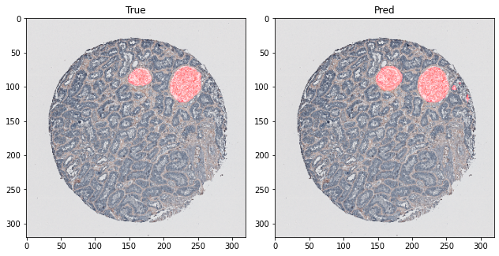
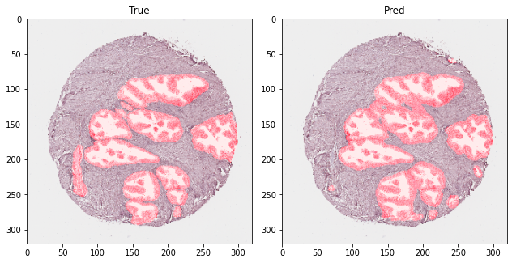

# Semantic segmentation of human organ tissue

* Segmentation is done by creating Unet model from torchvision's model Efficentnet b3 
* Data used is from [Kaggle competition] (https://www.kaggle.com/competitions/hubmap-organ-segmentation)
* The goal of competition was to identify and segment functional tissue units (FTUs) across five human organs.
* Data is available for free on the competition link.

## Example of mask prediction:

 
